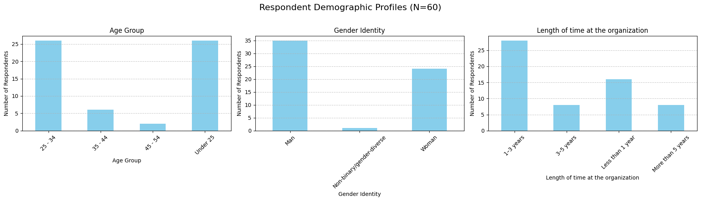
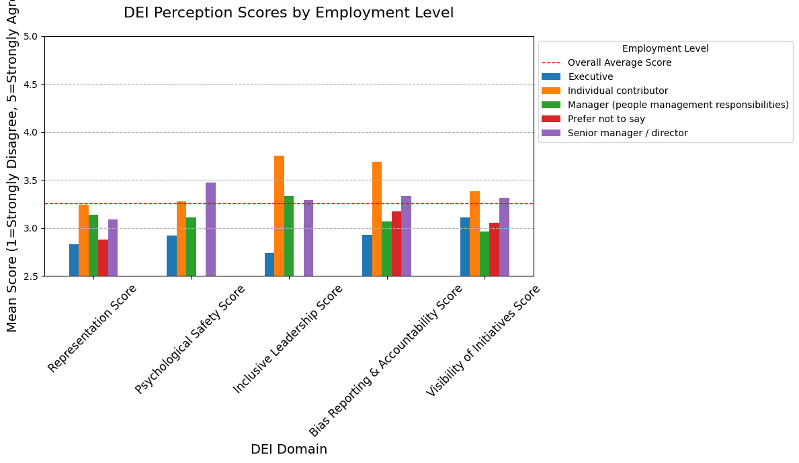
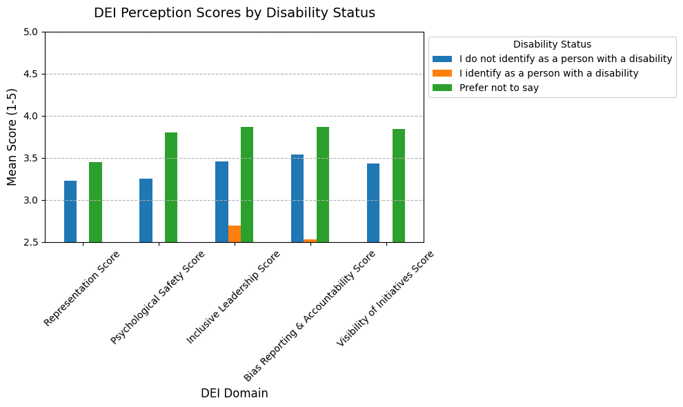
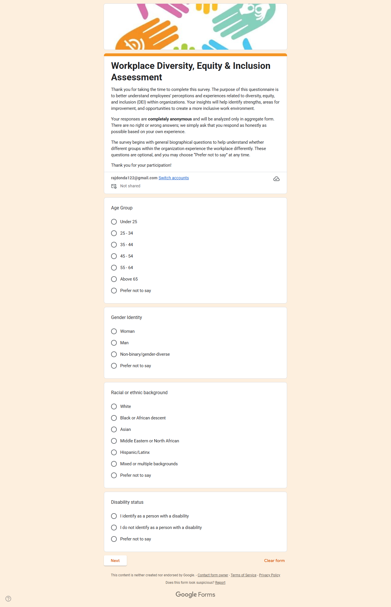
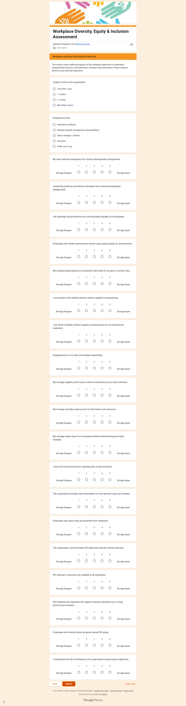
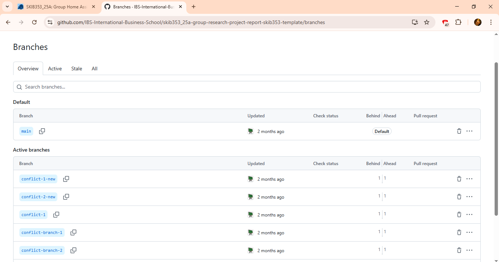
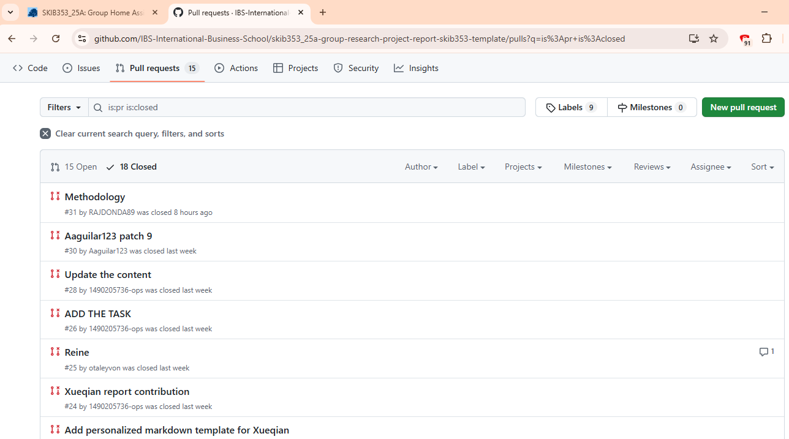
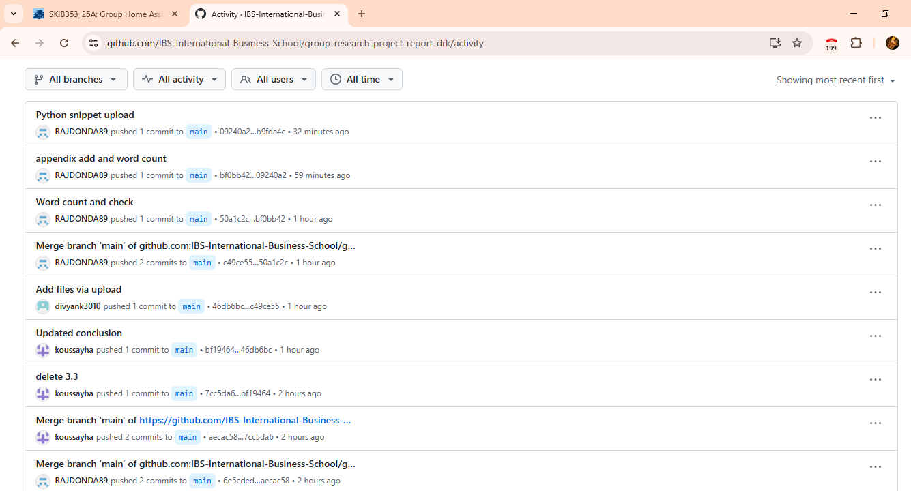
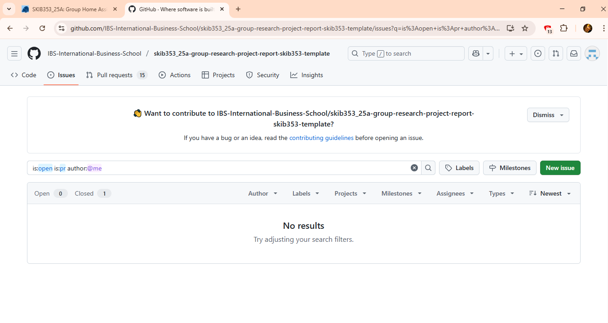

# Group Research Project Report

## Team Members:
1. Koussay Hazami
2. Churi Divyank Ramakant
3. Donda Raj

**Word-count : 2197 (Excluding Declaration, References and Appendix) 

## Declaration
[ChatGPT 5.0] was used to [brainstorm themes and structure] for this group research project report on [topic]. Prompt: '...' No AI-generated text is included in the final submission. Accessed: [Date]. Available at: https://chat.openai.com/.

We have retained a complete set of raw data, including questionnaires (papers completed by hand or record downloaded from the online survey platform), recordings, and/or transcripts of interviews, secondary data, etc., as well as data analysis files and documents. 

## GitHub Repository Link
The complete project repository, including code, documentation, images, and collaboration evidence, is available at:

🔗 https://github.com/IBS-International-Business-School/group-research-project-report-drk


## 1. Executive Summary

### Overview 

This research for EquiSphere assessed employee perceptions of **Diversity, Equity & Inclusion (DEI)** across five core domains to define the organizational **equity gap**. 
It used a quantitative approach with $N=60$ employee responses and statistical validation (T-tests).

### Key Findings 

#### 1. Critical Equity Gap 
There is a profound, statistically significant **Equity Gap**. 
* Employees with a disability score **0.91 points lower** on their overall DEI experience than their. 
*This gap is statistically significant ($p$-value = 0.0241), confirming a systemic failure. 

#### 2. Leadership Disconnect 
A major failure exists in execution and leadership perception.
 * The largest gap is a **1.01-point disparity** in **Inclusive Leadership** perception between staff and executives. 
* Executives rate their own leadership environment lowest (2.74), suggesting a crisis in managerial support or self-awareness at the top.
* Managers are the **least informed** group on the **Visibility of Initiatives. 

#### 3. Core Risk Area 
The **Representation** domain has the lowest overall score (Mean: 3.15), indicating a broad perception that diversity is not reflected, especially in leadership. 

### Actionable Recommendations
 | Priority | Focus Area | Recommended Action |
| :--- | :--- | :--- |
| **Highest** | Disability Gap | Mandate **immediate accessibility audits** to address the 0.91-point experience gap. |
| **High** | Leadership Disconnect | Implement **executive coaching and link accountability metrics** to performance reviews. |
| **Immediate**| Communication Failure | Shift from passive awareness to **active managerial integration** to ensure managers can enforce policies. |

> **Conclusion:** The primary challenge is not awareness, but **execution and accountability**.


## 2. Introduction

This research is focused on a quantitative analysis of employee perceptions concerning **Diversity, Equity & Inclusion (DEI)** within client organizations of EquiSphere. Our main goal is to define the true equity gap and pinpoint high-risk areas that require immediate, evidence-based strategy and action.


DEI is no longer just a trend; it's a strategic necessity for modern business. Organizations that fail to foster genuine inclusion face real consequences, including significant retention risk and decreased innovation. Effective DEI efforts depend on accountability, which is why it's crucial to move beyond simple awareness and accurately measure employee experiences. Identifying these disparities is the first step in addressing validated systemic failures, such as the confirmed negative experience gap for employees with disabilities.


### Key Areas of Inquiry

Our investigation focuses on assessing the current health of the organization across several critical dimensions of the employee experience:

* **Systemic Reflection of Diversity:** We examine how successfully diverse backgrounds are reflected across the workforce, with particular attention paid to representation in leadership positions.
* **Safety and Open Dialogue:** This assesses the level of psychological safety; the crucial belief that employees can speak up, admit mistakes, or express concerns without fear of negative consequences.
* **Fairness in Management:** We evaluate Inclusive Leadership behaviors, focusing on managerial actions that ensure fairness and provide equitable access to growth opportunities.
* **Trust in Justice:** This involves scrutinizing bias reporting and accountability to determine the perceived transparency and trustworthiness of the processes used to handle bias and protect employees from retaliation.
* **Communication Effectiveness:** We determine the level of employee awareness regarding DEI programs, resources, and progress by measuring the visibility of initiatives.


## 3. Methodology

### Survey Design

An organized online survey has been designed that had:

**Demographic questions** (age, gender identity, race/ethnicity, disability status, tenure, employment level)

**Five composite domains** of DEI, which are calculated using several Likert-scale items:

- **Representation**:It is vital to have a diversity of people in all levels and not only in the demographics but also in thinking, background, and experience and this helps create diverse opinions (HBR, 2019).

- **Psychological Safety**:This is to establish an atmosphere in which individuals feel secure to express their own views. Offer their thought, confess their mistakes without fear of retaliation. (Stoddard, n.d.).

- **Inclusive Leadership**:Leaders that show curiosity, courage, and conscientiousness to appreciate individuality, foster a sense of belonging, and advance the organizational DEI aims, sometimes by actively listening and making fair decisions (HBR, 2023).

- **Bias Reporting & Accountability**:It is necessary to retrieve a confidential, open system of reporting unfair treatment or bias, and have the concerns taken seriously and addressed fairly.Holding leaders and employees accountable to DEI commitments by having quantifiable goals, performance metrics, and repercussions of inaction or discriminatory action or behavior (HBR, 2022; Harvard Business Publishing, 2020).

- **Visibility of Initiatives**:Coming out publicly to report on DEI activities, gains, and statistics (such as representation rates) to create trust and demonstrate organizational true involvement (Harvard Business Publishing, 2020).

Responses were measured using a 1-5 Likert scale (1 = strongly disagree, 5 = strongly agree).


---

### 4. Results & Data Analysis

### 4.1 Data Analysis

The analysis section utilized Python libraries like Pandas, NumPy, and Matplotlib. The process involved several steps:

* **Descriptive Statistics:** Initial review of basic response patterns.
* **Demographic Analysis:** Breakdown of responses by age, gender, and other groups to understand survey representation.
* **Comparative Analysis:** Comparison of DEI domain scores based on employment status, ethnicity, and disability status to identify significant experiential differences between groups.
* **Item Analysis:** Determining the highest and lowest scoring survey questions to pinpoint the best and worst organizational DEI areas.


---

### 4.2 Demographic Overview

**Age:** A big proportion (43%) was 25-34 years, which implies that we have many professionals in their early career in our sample.
**Gender:** The majority of the respondents were females (26), and then there are males (21). Very few identified as non-binary or did not want to indicate.
**Tenture:** A large percentage of the respondents had a tenure of 1-3 years in the organisation.
**Level of employment:** Approximately 48% of the sample comprised individual contributors.This implies that the perspective of non-managers is highly represented.

These distributions bring out heterogeneity that is necessary in segmentation analysis.

#### Demographic Profiles** 

Figure 1: Demographic Profiles of respondants (N=60)

---

### 4.3 Overall DEI Domain Scores 

We averaged the scores of the five domains of DEI in order to get the general perception of DEI.

**Key observations:**

- The Bias Reporting has the highest mean (3.40), however, the standard deviation is high indicating the workers are not in agreement on whether the reporting system is fair or trustful.
- The true overall risk is Representation,because the score is the lowest(3.15).
It means that the employees feel that leadership fails to represent the diversity of the broader workforce.


Table 1. Overall DEI Domain Scores

|    **Domain**        |**Mean**|**SD**|**Min**|**Max**|
| -------------------- | ------ | ---- | ----- | ----- |
| Representation       | 3.15   | 1.17 |   1   |   5   |
| Psychological Safety | 3.20   | 1.11 |   1   |   5   |
| Inclusive Leadership | 3.39   | 1.23 |   1   |   5   |
| Bias Reporting       | 3.4    | 1.27 |   1   |   5   |
| Visibility           | 3.27   | 1.23 |   1   |   5   |


---

### 4.4 DEI Differences Across Employment Levels  


**The Equity Gap Insights:**

DEI was always rated lowest by the executives, particularly in Inclusive Leadership (2.74).This is not common practice since DEI scores have a tendency of rising with the seniority but this time around the executives appear to be more judgmental.DEI is rated by managers and senior managers/directors as the highest in nearly all areas with the score of around 3.3-3.5. Mid-range ratings were observed into individuals. This indicates that they do not have a considerably negative or strongly positive attitude toward DEI. 

#### DEI Scores by Employment Level**

Figure 2:DEI_Perception_by_Employment_Level

---

### 4.5 Strongest and Weakest Perceived DEI Items 


Table-2:Highest Risk/Streangth Area 

|                         Item               | Mean |
|--------------------------------------------|------|
| **Lowest-scoring:** Diverse leadership rep.| 2.77 |
| **Highest-scoring:** Manager accessibility | 3.56 |


The lack of diversity in the leadership position is observed among employees, which is directly connected with the low "Representation" domain.Employees feel their managers are approachable, but do not see sufficient diversity in leadership roles.

---

### 4.6 Majority vs Underrepresented Groups (URG)

The comparison of the experiences of the majority and URG respondents aids in comprehending whether the inclusion is constant among identities.Unexpectedly, URG respondents have a better score in all areas in this dataset. This could imply that majority groups are not as satisfied with the work of DEI or URGs are satisfied that actions of DEI have changed their world.

#### DEI Scores: Majority vs URG**

Figure 3:DEI_Perception_by_Majority vs Underrepresented Groups


Table-3:IDENTITY EQUITY GAP 

|    Domains        | Majority | URG |
|------------------ |----------|------|
| Representation    |   3.11   | 3.16 |
| Psych. Safety     |   2.97   | 3.29 |
| Inclu. Leadership |   2.98   | 3.56 |
| Bias Reporting    |   3.16   | 3.49 |
| Visibility        |   3.04   | 3.36 |

**Insights**: In contrast to other organisations, in which URGs report lower inclusion rates, here URGs seem slightly more favourable, which might indicate that these groups are specifically benefiting with DEI initiatives.

---

### 4.7 DEI Differences by Disability Status

Employees who stated that they had a disability scored significantly lower on DEI than other categories. This means that this would be one of the areas where the organisation might require to make a corrective action.

**Main points:**
- Disability group had the lowest score in all the five domains.
- The Prefer not to say group registered surprisingly high which could also be an indication of any issues of confidentiality with disclosure.

#### DEI Scores by Disability Status**

Figure 3:DEI Perception by Disability status


Table-4:Segmentation by Disability Status

|     Domain       | No Disability | Disability | Prefer Not to Say |
|------------------|---------------|------------|-------------------|
| Representation   |     3.23      |     2.83   |      3.46         |
| Psych. Safety    |     3.32      |     2.50   |      3.87         |
| Inclu.Leadership |     3.56      |     2.70   |      3.87         |
| Bias Reporting   |     3.35      |     2.53   |      3.46         |
| Visibility       |     3.38      |     2.87   |      3.87         |


---

## 5.  Discussion

This research successfully identified and validated critical equity gaps within the organization by assessing employee perceptions across five core DEI domains using preliminary pilot data (N=60). Our findings reveal that the organization's DEI challenges stem less from a lack of awareness and more from issues of execution and accountability.


### Synthesis of Key Findings

#### 1. The Validated Equity Crisis (Disability Status)
The most profound and statistically significant finding is the deep disparity in experience based on disability status. Employees identifying with a disability report an overall DEI experience 0.91 points lower than their peers. This systemic failure was confirmed with a high degree of certainty (p-value = 0.0241). This gap confirms a critical need for immediate reform of accessibility and inclusion policies. The finding underscores the importance of disability inclusion, as research notes the benefits of a diverse workforce and highlights the existing lack of disability data.

#### 2. The Leadership and Execution Disconnect
A major point of failure lies in the leadership structure. The largest perceptual gap found was a 1.01-point disparity in Inclusive Leadership between staff and executives.

* **Executive Perception:** Executives scored themselves and their environment lowest (2.74) in Inclusive Leadership. This suggests a crisis in managerial support or self-awareness at the top, which impacts the overall perception of the environment.
* **Managerial Failure:** This disconnect is compounded by the finding that managers (those responsible for people management) have the lowest score for the Visibility of Initiatives. This managerial communication gap proves that DEI initiatives "break down at the managerial level".
* **Implication:** This requires a pivot from passive awareness to active managerial integration, linking accountability metrics to performance reviews, a strategy supported by the literature emphasizing that DEI initiatives are futile without accountability. The role of leadership is consistently highlighted in shaping inclusion and performance.

#### 3. Core Risk in Representation
The domain of Representation received the lowest overall mean score (3.15). This indicates a broad perception that diversity is not adequately reflected, especially in leadership.


### Critical Assessment and Limitations

The findings provide a clear and statistically validated diagnosis for strategic intervention. However, the study is subject to several limitations:

* **Pilot Data Limitation:** The most significant limitation is the small sample size (N=60). While T-tests were used for validation , the small sample restricts the statistical certainty and generalizability required for enterprise-wide actions.
* **Sample Skew:** The data is heavily skewed toward Individual Contributors (48% of responses) and early-career talent. Our findings, therefore, strongly reflect the on-the-ground, daily experience and the retention risk of newer workforce segments.
* **Actionable Next Step:** To achieve statistical certainty and reliably measure the impact of the proposed policy reforms, the research must be scaled to a full-scale validation survey across the client population in the next 6-12 months.


---

## 6. Conclusion & Recommendations 

The research successfully utilized statistical validation to move beyond anecdotal evidence and confirm two major systemic risk areas: a profound, validated equity crisis concerning employees with disabilities and a critical **disconnect in leadership execution**. The current data establishes a crucial baseline for measuring future progress.

The following strategic recommendations are prioritized for immediate implementation to address the root causes of execution and accountability failures:

### 1. Highest Priority: Addressing the Disability Equity Gap


| Recommendation | Action Plan | Strategic Rationale |
| :--- | :--- | :--- |
| **Mandate Immediate Accessibility Audits** | Conduct comprehensive audits across all digital, physical, and procedural infrastructure. This includes reviewing hiring, training, and performance management processes for barriers. | Directly addresses the statistically validated equity crisis. This demonstrates commitment to inclusion and mitigates severe retention and legal risk. |

### 2. High Priority: Resolving the Leadership Disconnect


| Recommendation | Action Plan | Strategic Rationale |
| :--- | :--- | :--- |
| **Implement Executive Coaching and Accountability Metrics** | Provide targeted coaching to executives and senior managers focused on inclusive leadership principles. **Link accountability for DEI outcomes directly to performance reviews and compensation**. | Ensures senior leadership receives the necessary support to lead effectively. Establishes accountability, which is essential for DEI success. |

### 3. Immediate Priority: Fixing the Communication and Execution Failure


| Recommendation | Action Plan | Strategic Rationale |
| :--- | :--- | :--- |
| **Shift Focus to Active Managerial Integration** | Stop relying on passive awareness and pivot to equipping frontline managers directly. **Mandate training** that focuses on *how* to use DEI resources and *what* to implement. | Addresses the managerial communication gap. Enables managers to effectively enforce accountability. |

### Final Strategic Diagnosis

The primary challenge facing the organization is not a deficit in awareness of DEI principles, but a critical failure in **execution and accountability**. Strategic action must prioritize the validated equity crisis (disability status gap) and the top-down disconnect (Leadership/Managerial Gaps).


---


## References 

* HBR (2022) DEI Initiatives Are Futile Without Accountability. Available at: https://hbr.org/2022/02/dei-initiatives-are-futile-without-accountability (Accessed: 3 December 2025).
* HBR (2019) Survey: What Diversity and Inclusion Policies Do Employees Actually Want. Available at: https://hbr.org/2019/02/survey-what-diversity-and-inclusion-policies-do-employees-actually-want (Accessed: 3 December 2025).
* HBR (2023) What Makes an Inclusive Leader. Available at: https://hbr.org/2023/09/what-makes-an-inclusive-leader (Accessed: 3 December 2025).
* Business Disability Forum (n.d.) Why recruiting disabled people matters – The benefits of a diverse workforce. Available at: https://businessdisabilityforum.org.uk/resource/recruitment-toolkit/why-recruiting-disabled-people-matters-the-benefits-of-a-diverse-workforce/ (Accessed: 3 December 2025).
* Harvard Business Publishing (2020) The Three A’s of Inclusion: Awareness, Authenticity, and Accountability. Available at: https://www.harvardbusiness.org/wp-content/uploads/2020/07/The-Three-A-s-of-Inclusion-Awareness-Authenticity-Accountability.pdf (Accessed: 3 December 2025).
* McKinsey & Company (n.d.) The Missing Billion: Lack of disability data impedes healthcare equity. Available at: https://www.mckinsey.com/mhi/our-insights/the-missing-billion-lack-of-disability-data-impedes-healthcare-equity (Accessed: 3 December 2025).
* PsycNET/APA (2024) [The role of leadership in shaping inclusion and performance]. Available at: https://psycnet.apa.org/record/2024-62774-001 (Accessed: 3 December 2025).
* Stoddard, D. (n.d.) Psychological Safety: The Key to Unlocking the Benefits of DEI. Available at: https://www.damonstoddard.com/psychological-safety-the-key-to-unlocking-the-benefits-of-dei/ (Accessed: 3 December 2025).
* Medium/Bloom Consulting (n.d.) Centering our multiplicity and relationships: rethinking DEI through an Ubuntu lens. Available at: https://medium.com/bloom-consulting/centering-our-multiplicity-and-relationships-rethinking-dei-through-an-ubuntu-lens-e502f050e329 (Accessed: 3 December 2025).

... 

### **Appendix A — Survey Questionnaire**

**Title:** Workplace Diversity, Equity & Inclusion Assessment  
**Scale for DEI Items:**  
1 = Strongly Disagree  
2 = Disagree  
3 = Neutral  
4 = Agree  
5 = Strongly Agree  

---

#### **Section 1 — Demographic Questions**

1. **Age Group**
   - Under 25  
   - 25–34  
   - 35–44  
   - 45–54  
   - 55–64  
   - Above 65  
   - Prefer not to say  

2. **Gender Identity**
   - Woman  
   - Man  
   - Non-binary / gender-diverse  
   - Prefer not to say  

3. **Racial or Ethnic Background**
   - White  
   - Black or African descent  
   - Asian  
   - Middle Eastern or North African  
   - Hispanic / Latinx  
   - Mixed or multiple backgrounds  
   - Prefer not to say  

4. **Disability Status**
   - I identify as a person with a disability  
   - I do not identify as a person with a disability  
   - Prefer not to say  

5. **Length of Time at the Organisation**
   - Less than 1 year  
   - 1–3 years  
   - 3–5 years  
   - More than 5 years  

6. **Employment Level**
   - Individual contributor  
   - Manager (people management responsibilities)  
   - Senior manager / director  
   - Executive  
   - Prefer not to say  

---

#### **Section 2 — DEI Perceptions (Likert-Scale Items)**  
*(1 = Strongly Disagree → 5 = Strongly Agree)*

##### **Representation**
7. My team includes employees from diverse demographic backgrounds.  
8. Leadership positions are held by individuals from diverse demographic backgrounds.  

##### **Equity in Promotions & Opportunities**
9. Job openings and promotions are communicated equally to all employees.  
10. Employees with similar performance receive equal opportunities for advancement.  
11. My workload expectations are consistent with those of my peers in similar roles.  

##### **Psychological Safety**
12. I can express work-related opinions without negative consequences.  
13. I can admit mistakes without negative consequences for my performance evaluation.  
14. Disagreements in my team are handled respectfully.  

##### **Inclusive Leadership**
15. My manager applies performance criteria consistently across team members.  
16. My manager provides equal access to information and resources.  
17. My manager seeks input from employees before implementing team-level changes.  

##### **Bias Reporting & Accountability**
18. I know the formal process for reporting bias or discrimination.  
19. The organisation provides clear information on how reported cases are handled.  
20. Employees who report bias are protected from retaliation.  

##### **Visibility of DEI Initiatives**
21. The organisation communicates DEI objectives through internal channels.  
22. DEI training or resources are available to all employees.  
23. DEI initiatives are integrated into regular business operations (e.g., hiring, performance reviews).  
24. Employees are informed about progress toward DEI goals.  
25. I understand how DEI contributes to the organisation’s performance objectives.  

---

### Appendix B — Survey Form Layout (Optional)

Below are screenshots illustrating the structure of the Google Forms interface used to collect responses.

  


---

### Appendix C — GitHub Evidence

#### C1. Branching Workflow


#### C2. Pull Requests 


#### C3. Commit History


#### C4. Issue Tracking


---

### **Appendix D — Data Visualisations**


---

### Appendix E — Python Code Snippets

```python
# 1. Importing libraries and loading the dataset
import pandas as pd
import numpy as np
import matplotlib.pyplot as plt
import numpy as np

plt.rcParams["figure.figsize"] = (6, 4)
plt.rcParams["axes.grid"] = True

df = pd.read_excel("Workplace Diversity, Equity & Inclusion (Responses).xlsx")

# 2. Grouping survey items into DEI dimensions

rep_cols = [
    "My team includes employees from diverse demographic backgrounds.",
    "Leadership positions are held by individuals from diverse demographic backgrounds."
]

equity_cols = [
    "Job openings and promotions are communicated equally to all employees.",
    "Employees with similar performance receive equal opportunities for advancement.",
    "My workload expectations are consistent with those of my peers in similar roles.",
    "My manager applies performance criteria consistently across team members."
]

psych_cols = [
    "I can express work-related opinions without negative consequences.",
    "I can admit mistakes without negative consequences for my performance evaluation.",
    "Disagreements in my team are handled respectfully."
]

lead_cols = [
    "My manager provides equal access to information and resources.",
    "My manager seeks input from employees before implementing team-level changes."
]

report_cols = [
    "I know the formal process for reporting bias or discrimination.",
    "The organization provides clear information on how reported cases are handled.",
    "Employees who report bias are protected from retaliation."
]

vis_cols = [
    "The organization communicates DEI objectives through internal channels.",
    "DEI training or resources are available to all employees.",
    "DEI initiatives are integrated into regular business operations (e.g., hiring, performance reviews).",
    "Employees are informed about progress toward DEI goals.",
    "I understand how DEI contributes to the organization's performance objectives."
]

# 3. Calculating average scores
dims = {
    "Representation": df[rep_cols].mean().mean(),
    "Equity": df[equity_cols].mean().mean(),
    "Psychological safety": df[psych_cols].mean().mean(),
    "Leadership": df[lead_cols].mean().mean(),
    "Reporting": df[report_cols].mean().mean(),
    "DEI visibility": df[vis_cols].mean().mean()
}

# 4. Example visualisation – Radar chart
labels = list(dims.keys())
values = list(dims.values())
values += values[:1]

angles = np.linspace(0, 2*np.pi, len(labels), endpoint=False).tolist()
angles += angles[:1]

fig = plt.figure(figsize=(6, 6))
ax = fig.add_subplot(111, polar=True)

ax.plot(angles, values, linewidth=2)
ax.fill(angles, values, alpha=0.25)

ax.set_xticks(angles[:-1])
ax.set_xticklabels(labels)
ax.set_ylim(1, 5)
ax.set_title("Average scores by DEI dimension (1–5 scale)")

plt.show()

...

